# Opeartionalising of Machine Learning
## Overview
In this project a model is trained using Automated Machine Learning. Then it is operationalised using Microsoft Azure Machine Learning. The operationalising is also done using pipeline automation.

The dataset used here is a information of Portuguese Bank Marketing. The informations is based on phone calls , age, type of job, marital, education, has credit in defualt, housing, loan, type of contact , last contact, day of the week of the contact, duration in seconds, campaigns, and other variables. We want to predict if the client has subscribed a term deposit.
The csv file consist of 32950 row and 21 columns. The csv file(https://automlsamplenotebookdata.blob.core.windows.net/automl-sample-notebook-data/bankmarketing_train.csv). Here the loan column is the targeted column.

The steps involved:-
1. An AutoML model is trained using the Bank Marketing dataset.
2. Deployed the best model to an ACI (Azure Container Instance) using Azure ML Studio.
3. We enable the Application Insights feature and review the generated logs using the logs.py script.
4. We publish the deployed model API swagger documentation by running a docker container in our localhost. For which download the endpoint swagger.json file from Azure ML.
5. We consume the scoring API to clasify new instances by running the endpoint.py script in our localhost. We must get the scoring_uri and key for the deployed model endpoint and update the script.
6. Used Apachebenchmark for testing the model.

### Pipeline Automation
1. An AutoML model is trained using the Bank Marketing dataset.
2. We create a Pipeline, to automate the process and be able to repeat the process at any time.
3. We examine the metrics and the best model, which used the Voting Ensemble algorithm.
4. We test the model and examine the confusion metrics.
5. We publish the pipeline to generate a REST endpoint that allows us to rerun the pipeline at any time using any tool that can submit HTTP requests.
6. We send a request to the REST endpoint to rerun the pipeline.

## Architectural Diagram
Train and deploy an AutoML model using Azure ML Studio

Create, publish and consume a Pipeline for training an AutoML model, using a Jupyter Notebook and Azure ML SDK
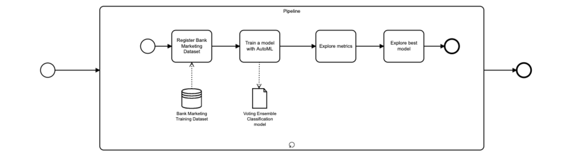

## Future Improvements
1. The model can be used for thousands of people then we can deploy the model to AKS instead of ACI.
2. We can automatically schedule the pipeline to retrain the AutoML model on in regular intervals as required.
3. We can publish the API swagger documentation to Azure also, so it is available for any user.
4.The pipeline can be extended to include a step to deploy the best model to AKS.

## Screenshots

Registered Datasets
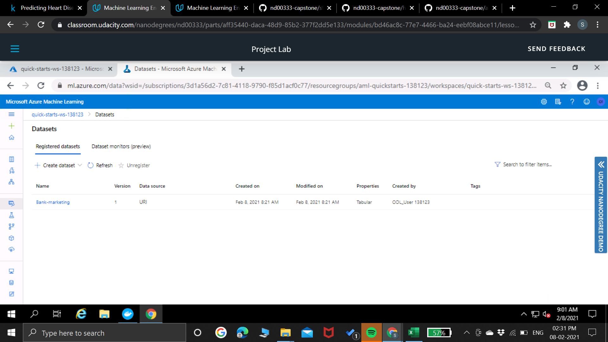

The experiment is shown as completed
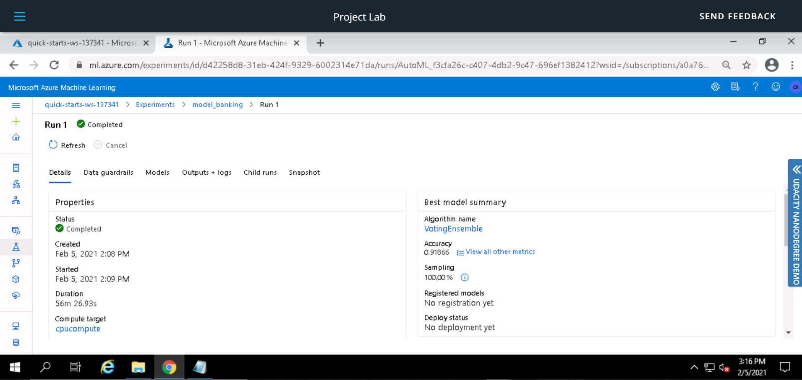

The best model after the experiment completes

Application Insights is enabled in the Details tab of the endpoint

Logs generated by the logs.py script
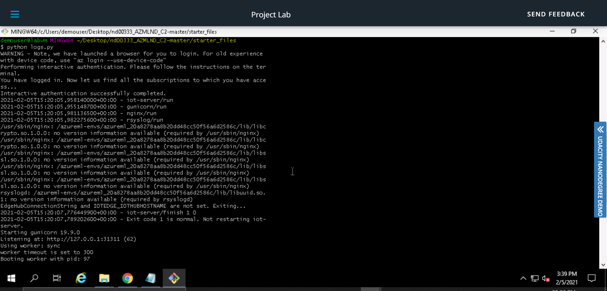
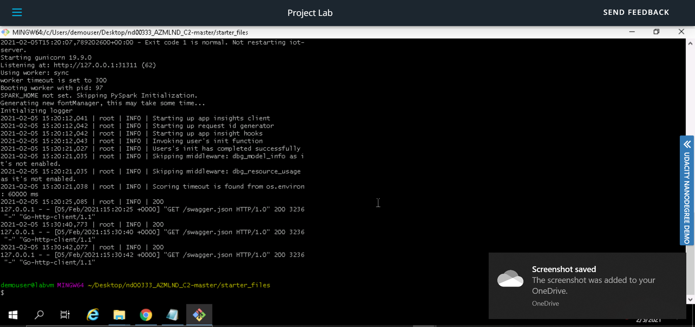

Swagger runs on localhost showing the HTTP API methods and responses for the model
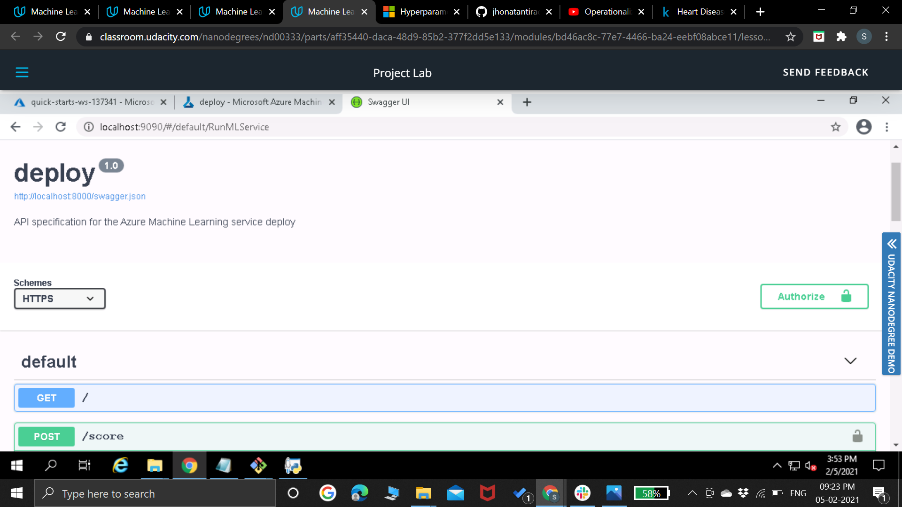

endpoint.py script runs against the API producing JSON output from the model
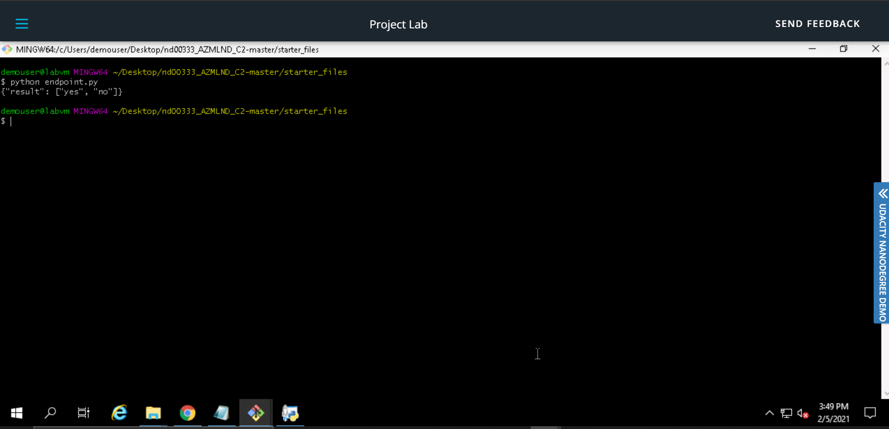

Pipeline section of Azure ML Studio, showing that the pipeline has been created

Pipelines section in Azure ML Studio, showing the Pipeline Endpoint
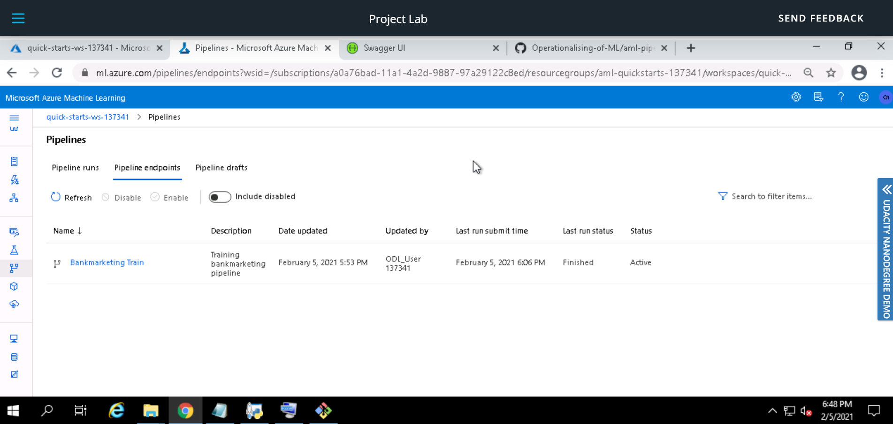

The Bankmarketing dataset with the AutoML module

The Published Pipeline overview, showing a REST endpoint and a status of ACTIVE
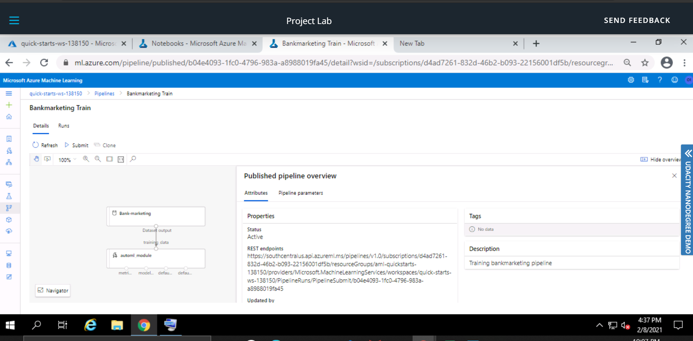

Jupyter Notebook showing the Use RunDetails Widget shows the step runs
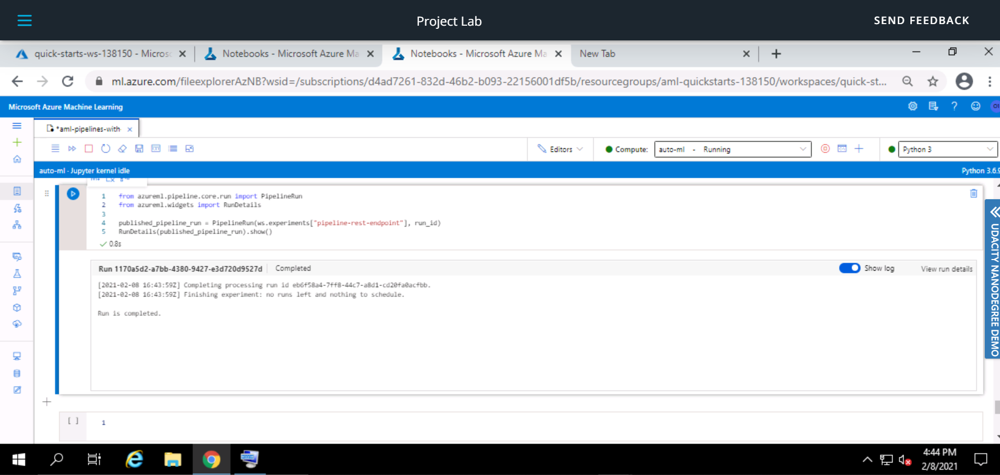

ML Studio showing the scheduled run
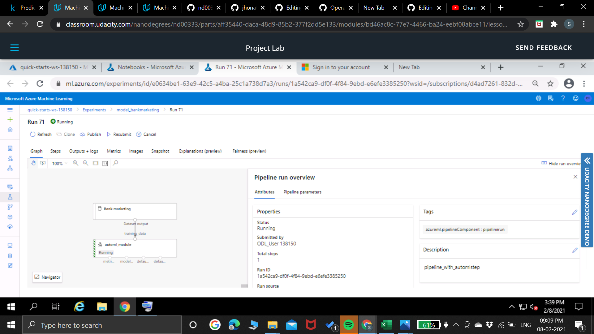

## Screencast

https://youtu.be/k1Qu_zx7bBM
